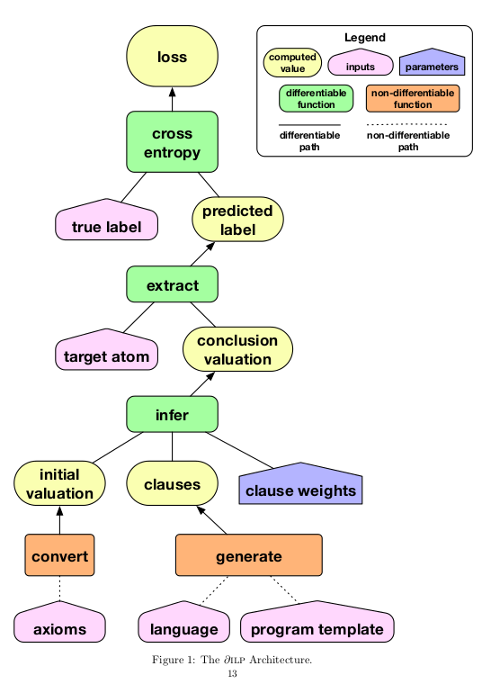
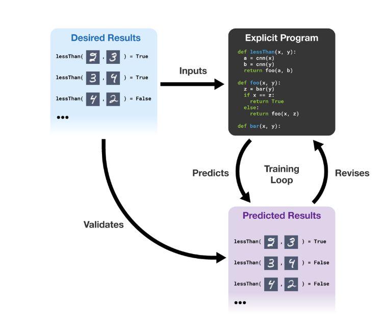

[Learning Explanatory Rules from Noisy Data](learning_explanatory_rules_from_noisy_data/learning_explanatory_rules_from_noisy_data.md)
#Learning Explanatory Rules from Noisy Data

[paper](http://www.jair.org/media/5714/live-5714-10391-jair.pdf)

1. Intuitive Perceptual Thinking ~> Deep Learning
2. Conceptual, Rule-based Thinking ~> symbolic program synthesis 

> deep learning systems are robust to noisy data but difficult to interpret and require large training data.
> symbolic systems are easier to interpret and less training data but struggle with noisy data.

∂ILP  `(continuous representations of rules are learned through BP against likelihood objectivew)` searches through the space of programs using gradient descent. if the outputs of the program conflict with the desired outputs from the reference data, the system revises the program to better match the data.

**extensional predicates VS intensional predicates**
**Satisfiability Problem**

###### training loop

#### Contribution

**Differentiable Inductive Logic Programming (∂ILP)**

**central component**
> differentiable implementation of deduction through forward chaining on definite clauses.

**Task**
> reinterpret ILP task as a binary classification problem, and minimise cross-entropy loss with regard to ground-truth boolean labels during training.

**Major limitation**
> it requires significant memory resources. 

currently only support predicates of arity 0,1,2. Not support ternary predicates or higher

**4 restriction for generated clauses**
> 1. rule out clauses that are unsafe (a variable used in the head is not used in the body)
> 2. circular
> 3. duplicated
> 4. do not respect the intensional flag int 

##### Basic Definition

**clauses**
> α ← α1,...,αm
> 
> head ← body

**atom**
> α = tuple p(t1, ..., tn)
> p = n-ary predicate
> t1, ..., tn = items (variables | constants)
