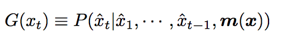
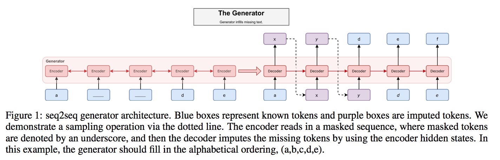
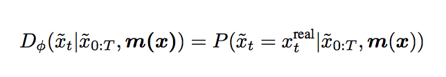
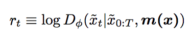
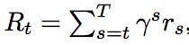

# Mask GAN: Better Text Generation via Filling In The ___

[paper](pdf/maskGAN.pdf)

### Contribution

> **sample quality**
> 		
> 		(a cost functin on the output of RNN, which could encourage high sample quality)
> 
> **actir-critic conditional GAN**
> 
> 

---
### Some insppiration

> non-differentiable sampling operations with effecient gradient approximators (Jang 2016, Maddison 2016)
> 
> unbiased and low variance gradient estimate techniques such as (Tucker 2017)

---
### Model 

##### Target 
> infill the missing portions of text so that it is indistinguishable from the original data.

##### Error per time step
> discriminator will evaluate each token and thus provide a **fine-grained supervision signal to the generator**.

---

##### Architecture
**seq2seq**

##### Generator
Output distribution over the vocabulary size.



```m(x) is a mask function for x. ```
```for instance x = [happy new year],```
```m(x) = [1,0,1], then m(x) = [happy <m> year]```
```model should fill in the <m>```

--

##### Discriminator

**Identical to generator**, except the **output is a scalar probability at each time point**, rather than a distribution over the vocabulary size.

```input data:```

	filled-in sequence from the generator,
	the original true context if the masked sequence m(x).

discriminator: 


reward:
```the logarithm of the discriminator estimates are regarded as the reward```


--

##### Critic Network

estimates the value function, which is the discounted total return of the filled-in sequence 

where γ is the discount factor.

--

##### Sampling Operation

---
### Related Work
> **Professor Forcing(Lamb, 2016)** and **Scheduled Sampling(Bengio, 2015)**
>  
> 		try to solve unpredicable dynamics in the hidden state of RNN (because teacher forcing, ground-truth words are fed back into the model), 
> 
> 		**BUT**, they do not specify a cost function on the output of the RNN encouraging high sample quality
> 
>  **Professor Forcing**
> 
> 	using a discriminator to discriminate the **hidden states of a generator RNN** that is conditioned on real and synthetic samples.
> 	gradients can be passed through to the generator so that hiddfen state dynamics at inference time follow those at training time.

> **vanilly GAN**
> 
> 		trainig instability 
> 		mode dropping
> 			when certain modalities in the training set are rarely generated by the generator.
> 
> **SeqGAN(Yu, 2017)** 
> 
> 		train a language model by using policy gradients to train the generator to fool a CNN-based discriminator that discriminates between real and synthetic text.
> 
> 		Both generator and discriminator are pretrained on real and fake data before the phase of training with policy gradients.
> 
> 		During training they then do Monte Carlo rollouts in order to get a useful loss signalper word.
> 
> **Duscrete GANs(Yang, 2017)**
> 
> 	improvement in **BLEU score for  Chinese-English translation**.
> 
> ** Dialogue generation(Li, 2017)
> 	Reinforce with Monte Crlo sampling on the generator.
> 
> **WGAN-GP (Gulrajani 2017)
> 		
> 		avoids the issue of dealing with BP through discrete nodes by generating text in a one-shot manner using a 1D CNN.
> 
> 还有好几个，不想写了

---
