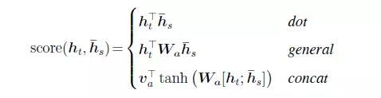
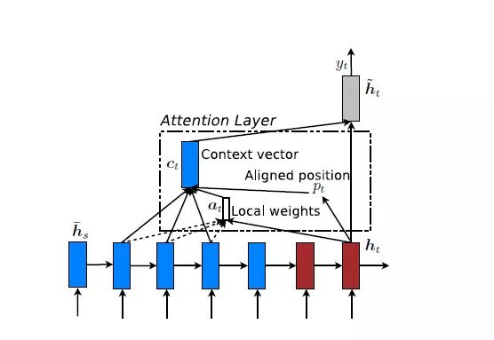

# Attention Knowledge


## vanilla attention

get outside info into account: *h\_hat*

传统的Attention是基于source端和target端的隐变量（hidden state）计算Attention的，得到的结果是源端的每个词与目标端每个词之间的依赖关系。 忽略了源端或目标端句子中词与词之间的依赖关系


score的三种计算方式  


```python
## pytorch
# calculate code for: 
		general, 
		dot, 
		concat 
def score(hs, ht, attn_type, attn_dim=None):
	"""
	hs: source hidden state, shape=[batch, src_length, source_dim]
	ht: target hidden state, shape=[batch, tgt_length, target_dim]
	"""
	tgt_batch, tgt_len, tgt_dim = ht.size()
	src_batch, src_len, src_dim = hs.size()
	if attn_type=='dot':
		# src_dim == tgt_dim 
		h_s_ = h_s.transpose(1, 2)  # [batch, src_dim, src_len]
		# (batch, tgt_len, tgt_dim) * (batch, src_dim, src_len)
		return torch.bmm(h_t, h_s_)
	elif attn_type=='general':
		# src_dim != tgt_dim
		linear_in = nn.Linear(tgt_dim, src_dim, bias=False)
		h_t_ = h_t.view(tgt_batch*tgt_len, tgt_dim)
		h_t_ = linear_in(h_t_)
		h_t = h_t_.view(tgt_batch, tgt_len, tgt_dim)
		return torch.bmm(h_t, h_s_)
	elif attn_type=='mlp':
		assert attn_dim
		dim = attn_dim
		linear_query = nn.Linear(tgt_dim, attn_dim, bias=False)
		linear_context = nn.Linear(src_dim, attn_dim, bias=False)
		wq = linear_query(h_t.view(-1, self.tgt_dim))
		wq = wq.view(tgt_batch, tgt_len, 1, dim)
		wq = wq.expand(tgt_batch, tgt_len, src_len, dim)
		uh = linear_context(h_s.contiguous().view(-1, self.src_dim))
		uh = uh.view(src_batch, 1, src_len, dim)
		uh = uh.expand(src_batch, tgt_len, src_len, dim)
		wquh = self.tanh(wq + uh) # (batch, tgt_len, src_len, dim)
		v = nn.Linear(attn_dim, 1, bias=False)
		return v(wquh.view(-1, dim)).view(tgt_batch, tgt_len, src_len)
```

--
+ global attention
+ local attention:
	+ 预测一个source端对齐位置
	+ 

--
[link](https://jhui.github.io/2017/03/15/Soft-and-hard-attention/)

+ soft attention
+ hard attention
	+ 依概率Si来采样输入端的隐状态一部分来进行计算  

```python
## hard attention, sampling 
if use_prior:  
  # p_scores are softmax attention value
  
```


## Self-Attention

such attention mechanism is using the representation itself, and learnable parameters, produce attention weights via **dot production**.

捕捉source端或target端自身的词与词之间的依赖关系；然后再把source端的得到的self Attention加入到target端得到的Attention中，捕捉source端和target端词与词之间的依赖关系

--

for **n** steps's vector representation:


attention can be calculated via: 


attention weighted vector representation: 


where:

```
H: (n, u), n is number of steps, u is embedding dimension
W_s1: (d, u), d is attention dimension
W_s2: (1, d)
a: (1, n)
```

## Query, Key, Value
[Attention is all you need](https://arxiv.org/abs/1706.03762)

An attention function can be described as mapping a query and a set of key-value pairs to an output, where the query, keys, values, and output are all vectors

<mark>self-attention is special case of QKV, when key=value


**Q, K, V** is produced by linear projection from **input** with learnable parameters. 

Attention is produced by dot-product with Q, K and V, scale it and softmax.


## Penality

+ [KL and Unit diversity](../A STRUCTURED SELF-ATTENTIVE SENTENCE EMBEDDING/A STRUCTURED SELF-ATTENTIVE SENTENCE EMBEDDING.md)

## Even More
+ Hierarchical Attention
+ Attention over Attention
+ Multi-step Attention

### reference
+ [【深度学习与NLP_知乎】](https://zhuanlan.zhihu.com/p/31547842)
+ [【transformer blog】](https://mchromiak.github.io/articles/2017/Sep/12/Transformer-Attention-is-all-you-need/#.W3lSbNgzYWo)