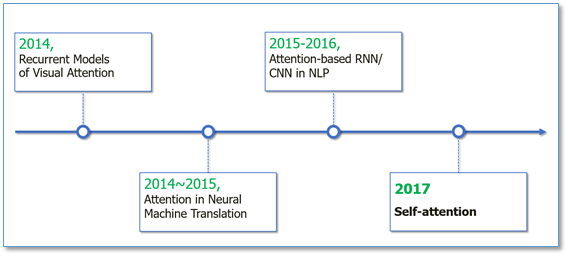
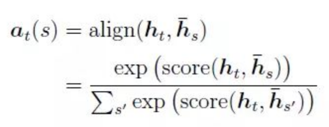
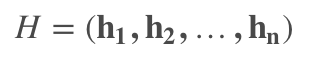
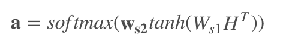
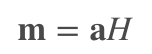
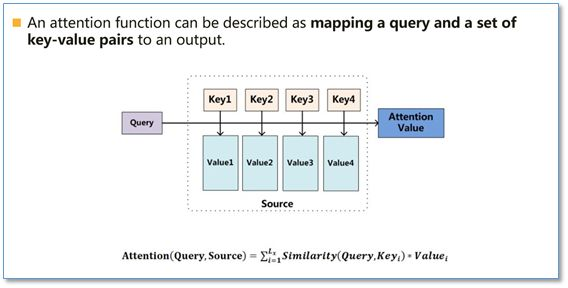
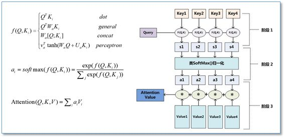
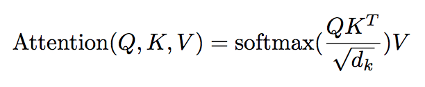

# Attention Knowledge





## vanilla attention

get outside info into account: *h\_hat*

传统的Attention是基于source端和target端的隐变量（hidden state）计算Attention的，得到的结果是源端的每个词与目标端每个词之间的依赖关系。 忽略了源端或目标端句子中词与词之间的依赖关系



--
+ global attention
+ local attention:
	+ 预测一个source端对齐位置

--
[link](https://jhui.github.io/2017/03/15/Soft-and-hard-attention/)

+ soft attention
+ hard attention
	+ 依概率Si来采样输入端的隐状态一部分来进行计算

## Self-Attention

such attention mechanism is using the representation itself, and learnable parameters, produce attention weights via **dot production**.

捕捉source端或target端自身的词与词之间的依赖关系；然后再把source端的得到的self Attention加入到target端得到的Attention中，捕捉source端和target端词与词之间的依赖关系

--

for **n** steps's vector representation:



attention can be calculated via: 



attention weighted vector representation: 



where:

```
H: (n, u), n is number of steps, u is embedding dimension
W_s1: (d, u), d is attention dimension
W_s2: (1, d)
a: (1, n)
```

## Query, Key, Value
[Attention is all you need](https://arxiv.org/abs/1706.03762)

An attention function can be described as mapping a query and a set of key-value pairs to an output, where the query, keys, values, and output are all vectors

<mark>self-attention is special case of QKV, when key=value






**Q, K, V** is produced by linear projection from **input** with learnable parameters. 

Attention is produced by dot-product with Q, K and V, scale it and softmax.



## Even More
+ Hierarchical Attention
+ Attention over Attention
+ Multi-step Attention

### reference
+ [【深度学习与NLP_知乎】](https://zhuanlan.zhihu.com/p/31547842)
+ [【transformer blog】](https://mchromiak.github.io/articles/2017/Sep/12/Transformer-Attention-is-all-you-need/#.W3lSbNgzYWo)